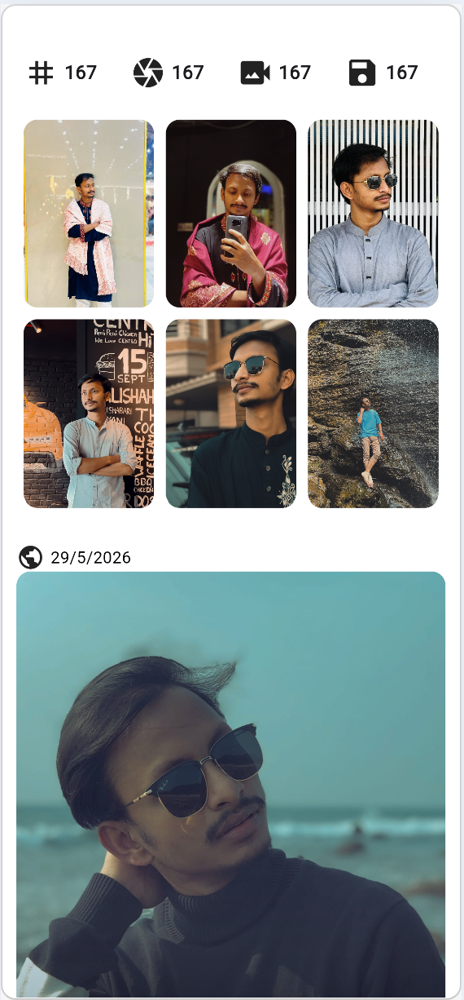
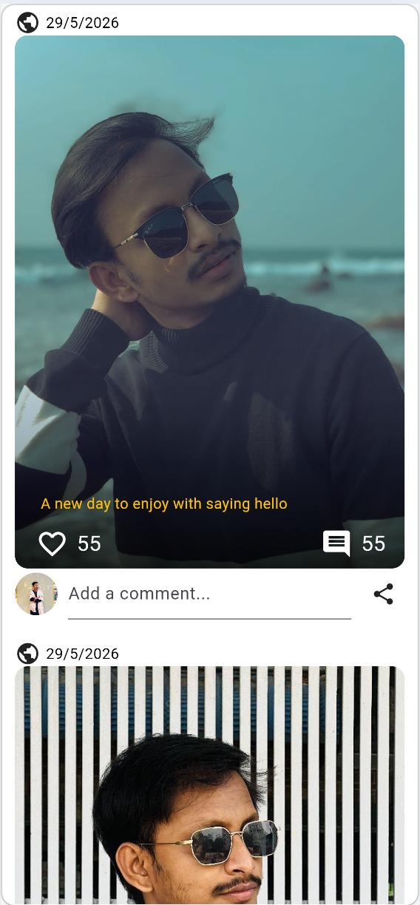
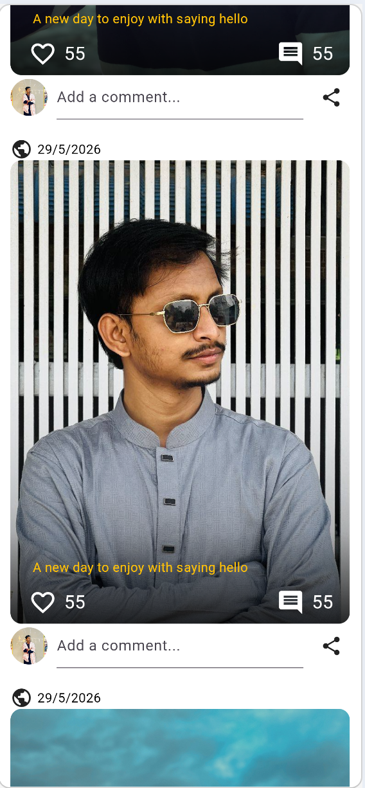

# Social Media Profile UI - Flutter Application

A modern, beautifully designed social media profile interface built with Flutter. This UI component showcases a complete social media profile layout with profile cards, follower statistics, image galleries, and interactive posts.


## 📱 Screenshots

*You can add your screenshots here. Place them in the `assets/screenshots/` folder and update the paths below:*

| Profile Header | Profile Card |
|----------------|--------------|
|  |  |

| Gallery Section | Posts Feed |
|----------------|-------------|
|  |  |

## ✨ Features

### 📸 Profile Section
- **Hero Profile Card** with gradient overlay and cover image
- User information display (name, username, bio)
- Follow button with interactive UI
- Menu button for additional options

### 👥 Social Statistics
- Followers count display with avatar previews
- Following count with avatar previews
- Dark-themed stat cards for better visibility

### 🎯 Highlights Area
- Horizontal scrollable highlights section
- "Add Highlight" option with icon
- Circular highlight images with border styling
- Label support for each highlight

### 🖼️ Gallery Grid
- 3x3 grid layout for media content
- Statistics counters for:
  - Posts (grid icon)
  - Photos (camera icon)
  - Videos (video icon)
  - Saved content (save icon)
- Masonry-style image grid layout
- Rounded corner image containers

### 📝 Posts Feed
- Multiple post cards with:
  - Timestamp display (auto-updating)
  - Cover images with gradient overlays
  - Post captions
  - Like and comment counters
  - Interactive buttons (like, comment, share)
- Comment input section with user avatar
- Smooth scrolling experience

## 🚀 Getting Started

### Prerequisites

- [Flutter SDK](https://flutter.dev/docs/get-started/install) (3.0 or higher)
- [Dart SDK](https://dart.dev/get-dart) (3.0 or higher)
- Android Studio / VS Code with Flutter extensions

### Installation

1. **Clone the repository**
   ```bash
   git clone https://github.com/yourusername/social-media-profile-ui.git
   cd social-media-profile-ui